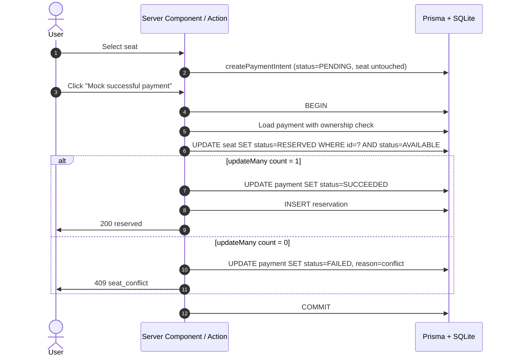

# Linkz Seats

A small public seat reservation platform built for a senior engineer technical
assessment. It shows three seats, lets authenticated users select one, runs a
mock payment flow, and reserves the seat only after a successful payment
completion.

The goal of the rewrite is to look and feel like a production codebase: a
feature-sliced folder layout, a domain layer with typed `Result` returns,
Server Components and Server Actions doing the heavy lifting, an accessible
Tailwind-based UI with dark mode, toasts, and tasteful micro-interactions, and
tests that cover the reservation invariants — including the race that the
conditional `UPDATE` is designed to handle.

## Stack

- **Next.js 14 (App Router)** with React Server Components and Server Actions
- **TypeScript** in strict mode
- **Prisma + SQLite** for local review (swappable with Postgres for production)
- **NextAuth** credentials login with 90-day JWT sessions
- **Tailwind CSS** with CSS variable theming and class-based dark mode
- **sonner** for toasts, **lucide-react** for icons
- **Zod** for input and environment validation
- **Vitest** for domain-level integration tests against a real Prisma client

## Features

- Public seat availability page with exactly three seats: `A1`, `A2`, `A3`.
- Visual seat map with a stage indicator, status badges, keyboard-friendly
  tiles, optimistic selection, and a contextual checkout summary.
- Light/dark theme with no-flash hydration via an inline bootstrap script.
- Toast notifications and animated inline feedback for payment outcomes.
- Demo login with prefilled credentials and `useTransition` pending states.
- Authenticated seat selection and payment intent creation via Server Actions.
- Mock checkout page with success and failure buttons.
- Final reservation happens only after successful payment completion.
- Failed payments keep seats available.
- Already-reserved seats cannot be selected or paid for.
- Repeated payment completion is idempotent.
- Ownership checks prevent one user completing another user's payment.
- Conflict response when a seat is reserved between intent and completion.

## Getting Started

### Prerequisites

- Node.js 20.11+
- npm

### Install

```bash
npm install
```

### Environment

Copy the example environment file:

```bash
cp .env.example .env
```

`src/lib/env.ts` validates the configuration at startup and refuses to boot
with a missing or obviously bad value, so deployment issues fail fast and
loudly instead of through obscure downstream errors.

### Database

Create the local SQLite database and seed demo data:

```bash
npm run db:migrate
npm run db:seed
```

Seeds:

- User: `demo@example.com`
- Password: `password123`
- Seats: `A1`, `A2`, `A3`

### Run

```bash
npm run dev
```

Open [http://localhost:3000](http://localhost:3000).

## Scripts

| Script                | Purpose                                           |
| --------------------- | ------------------------------------------------- |
| `npm run dev`         | Start the development server.                     |
| `npm run build`       | `prisma generate` + `next build`.                 |
| `npm run start`       | Start a production server after build.            |
| `npm run lint`        | Run Next/ESLint with `--max-warnings=0`.          |
| `npm run format`      | Format the workspace with Prettier.               |
| `npm run format:check`| Check formatting without writing.                 |
| `npm test`            | Reset test SQLite DB and run Vitest.              |
| `npm run test:watch`  | Vitest in watch mode (test DB must exist).        |
| `npm run db:migrate`  | Run Prisma migrations locally.                    |
| `npm run db:seed`     | Seed the demo user and three seats.               |
| `npm run db:studio`   | Inspect the database with Prisma Studio.          |

Scripts use `cross-env` so they work identically on Windows PowerShell, cmd,
and POSIX shells.

## Architecture

The codebase is sliced by feature rather than by technical layer. Each
feature owns its UI, server actions, schemas, and pure domain functions; the
`src/lib` folder only carries cross-feature utilities.

```text
src/
  app/                       Next.js App Router (RSC pages, route handlers)
    api/                     Public JSON API surface
    payment/[paymentId]/     Mock checkout page + loading/not-found states
  components/                Shared layout primitives
    ui/                      Stateless UI library (Button, Card, Badge, ...)
  features/
    auth/                    NextAuth options, session helpers, forms
    payments/                Domain logic, Zod schemas, Server Actions, UI
      __tests__/             Vitest integration tests
    seats/                   Seat queries and seat-map UI
  lib/
    cn.ts                    Tailwind class-merging helper
    db.ts                    Prisma singleton
    enums.ts                 SeatStatus / PaymentStatus enums + guards
    env.ts                   Zod-validated runtime environment
    logger.ts                Structured JSON logger
    money.ts                 Currency formatter
    result.ts                Result<T, ErrorCode> discriminated union
    seed.ts                  Shared demo-seed function
```

### Domain layer

`createPaymentIntent` and `completePaymentAndReserve` are pure functions
parameterised by the Prisma client. They never throw on expected business
failures — they return a `Result<T, ErrorCode>` so callers must handle each
outcome explicitly. That makes the API surface, the Server Actions, and the
tests share a single source of truth for what can go wrong.

The reservation invariant lives entirely inside one transaction in
`features/payments/complete-payment.ts`:



The conditional `UPDATE` is the linchpin: two concurrent completions will both
see a PENDING payment row, but only one will receive `count === 1` from the
seat update — the other will be reported as a conflict and its payment will be
marked failed. This is covered by an explicit integration test.

### Server Actions vs. JSON API

Mutations are exposed twice on purpose:

- **Server Actions** (`features/payments/actions.ts`) drive the UI. They run
  on the server, integrate with `useTransition` for clean pending states, and
  call `revalidatePath` to keep RSC views in sync without a full reload.
- **JSON API routes** (`app/api/...`) expose the same domain functions for
  programmatic access (curl, integrations, future mobile clients). They are
  thin wrappers around the same domain functions and share the same
  `Result → HTTP status` mapping via `app/api/http.ts`.

### Error handling and HTTP

Domain `Err` codes map to HTTP statuses in one place:

| Code                | Status |
| ------------------- | -----: |
| `unauthorized`      |    401 |
| `forbidden`         |    403 |
| `seat_not_found`    |    404 |
| `payment_not_found` |    404 |
| `invalid_input`     |    422 |
| `seat_unavailable`  |    409 |
| `seat_conflict`     |    409 |

Adding a new code without a mapping intentionally defaults to 400 so it
surfaces in review.

### UI

- Server Components fetch data; client components are limited to the seat
  map, login form, checkout panel, theme toggle, auth menu, and the global
  toast/session providers.
- `useTransition` gives every mutation a clean pending UI without blocking
  the page.
- Theme switching is class-based (`dark` class on `<html>`) with an inline
  bootstrap script to avoid the light-mode flash before hydration.
- Tailwind tokens live as HSL CSS variables so light/dark share the same
  utility classes (`bg-panel`, `text-muted-foreground`, etc.).

## Failure Handling

- Unauthenticated API calls return `401`.
- Invalid request payloads return `422`.
- Missing payments or seats return `404`.
- Payment ownership violations return `403`.
- Seat availability races between intent and completion return `409`.
- Failed mock payments mark the payment failed and leave the seat available.
- Repeated successful completion returns the existing reservation result
  without duplicating records.

## Trade-Offs

- **SQLite** keeps setup fast for reviewers. Production should use Postgres
  with stronger operational tooling for concurrency, backups, and
  observability. Prisma also lets the same code target Postgres almost
  unchanged.
- **Mock payment completion** is synchronous. A real integration should use
  hosted checkout, signed webhooks, provider-supplied idempotency keys, and
  refund/void handling if inventory conflicts after a charge.
- **Seat holds.** The app does not hold seats while a user is on the payment
  page. That avoids abandoned-hold cleanup, but a user can lose their seat
  if another payment completes first — which is exactly the path the
  `seat_conflict` branch handles, with a regression test.
- **Credentials auth** is used for assessment speed. Production should add
  rate limiting, email verification, password reset, stronger password
  policy, and ideally a managed identity provider.
- **Tests** focus on business invariants rather than exhaustive UI behavior
  because payment/reservation correctness is the highest-risk area.

## Verification Checklist

1. Visit the home page while logged out and confirm all three seats render.
2. Select an available seat and confirm the app sends you to login.
3. Log in with `demo@example.com` / `password123`.
4. Select a seat and proceed to payment.
5. Click `Mock failed payment` and confirm the seat remains available and a
   toast appears.
6. Create a new payment for the same seat.
7. Click `Mock successful payment` and confirm the seat becomes reserved and
   the seat tile shows "Reserved by you" after returning home.
8. Refresh the home page and confirm reservation state persists.
9. Try selecting the reserved seat and confirm it is disabled.
10. Toggle dark mode via the header button.
11. Run `npm test`, `npm run lint`, and `npm run build`.
