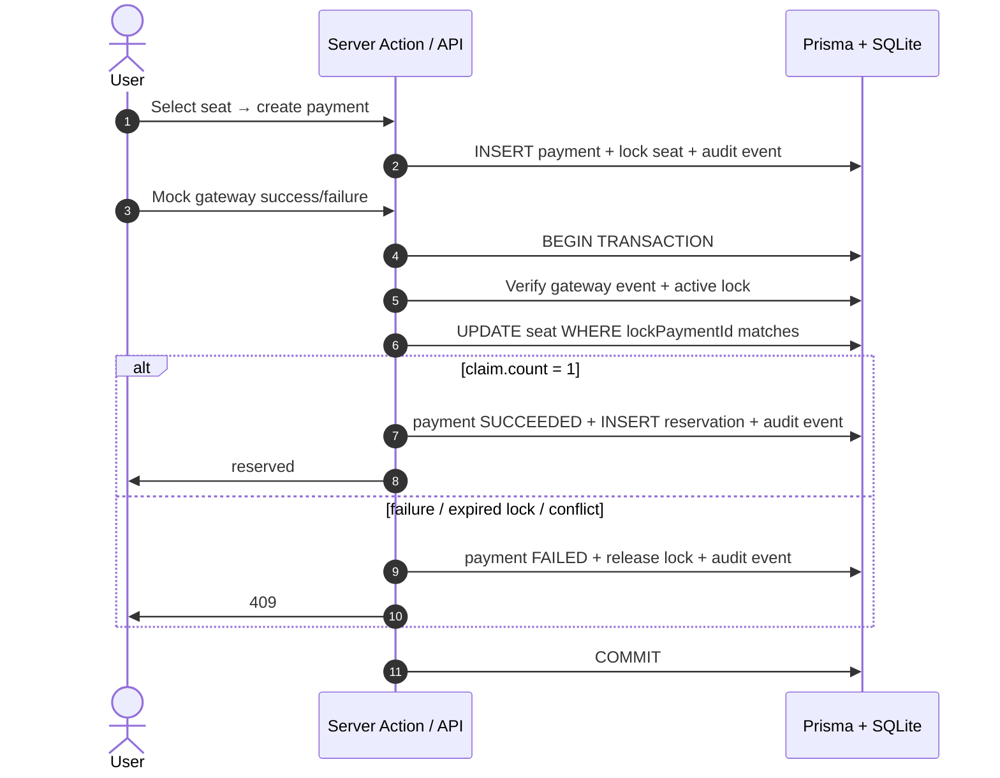

# Linkz Seats

Public seat reservation demo: three seats (`A1`–`A3`), Clerk authentication,
short-lived provider sessions with refresh handled by Clerk, mock checkout, and
reservation only after a trusted payment-gateway event.

Built with Next.js App Router, a feature-sliced layout, typed domain `Result`s,
Server Actions for mutations, seat locks, payment audit events, and Vitest tests
for payment/reservation invariants.

## Stack

| Layer      | Choice                                                                |
| ---------- | --------------------------------------------------------------------- |
| Framework  | Next.js 14 (App Router), React 18, TypeScript (strict)                |
| Data       | Prisma 5, SQLite locally (`file:./dev.db`)                            |
| Auth       | Clerk (`@clerk/nextjs`) with provider-managed refresh/session renewal |
| UI         | Tailwind CSS, lucide-react, sonner toasts                             |
| Validation | Zod (HTTP payloads + `src/lib/env.ts`)                                |
| Tests      | Vitest, real Prisma client against `prisma/test.db`                   |
| Container  | Multi-stage Dockerfile (Alpine, non-root, tini) + Docker Compose      |

## Features

- Public home page with a visual seat map (stage, status badges, keyboard focus).
- Light theme by default; optional dark mode (persisted in `localStorage`).
- Sign-in through Clerk; seat selection redirects guests to `/login`.
- Payment intent locks the seat for checkout and writes an audit event.
- Mock gateway completion records success/failure events before reservation.
- Seat becomes `RESERVED` only inside `completePaymentAndReserve` transaction.
- Failed payments release the lock and leave the seat `AVAILABLE`.
- Idempotent gateway event handling; ownership checks; `409` on lock conflicts.
- `/api/health` endpoint for liveness/readiness checks.

## Quick start (local Node)

### Prerequisites

- Node.js **20.11+**
- npm

### 1. Install

```bash
npm install
```

### 2. Environment

Copy `.env.example` to `.env` and set at least:

```env
DATABASE_URL="file:./dev.db"
NEXT_PUBLIC_CLERK_PUBLISHABLE_KEY="pk_test_..."
CLERK_SECRET_KEY="sk_test_..."
```

`src/lib/env.ts` validates variables at startup. In production,
both Clerk keys are required. Configure the Clerk application session lifetime to
90 days in the Clerk dashboard; the app does not issue a 90-day JWT itself.

Optional: `LOG_LEVEL` — `debug` | `info` | `warn` | `error` (default: `debug`
in development, `info` in production).

### 3. Database

```bash
npm run db:migrate
npm run db:seed
```

`db:seed` runs `prisma/seed.mjs` (committed to the repo). It resets payment,
reservation, lock, and audit rows, then upserts seats `A1`, `A2`, and `A3`.
Users are created from Clerk identities on first sign-in; no local password data
is seeded or stored.

Local DB files (`prisma/dev.db`, `prisma/test.db`) are gitignored.

### 4. Run

```bash
npm run dev
```

Open [http://localhost:3000](http://localhost:3000).

## Quick start (Docker)

A multi-stage `Dockerfile` builds a slim Alpine image that runs Next.js as a
non-root user with `tini` as PID 1. **SQLite** is the database: the file lives
at `/app/data/app.db` inside a named Docker volume (`linkz-seats-data`), so
reservations survive image rebuilds.

Optional overrides (recommended for anything beyond a local demo):

```bash
cp .env.docker.example .env.docker
# edit the Clerk keys, then:
docker compose --env-file .env.docker up -d --build
```

Or use the built-in defaults from `docker-compose.yml`:

```bash
# Build + start in the background
docker compose up -d --build

# Tail logs (handy while migrations + seed run)
docker compose logs -f web

# Stop
docker compose down

# Reset persistent data
docker compose down -v
```

Then open [http://localhost:3000](http://localhost:3000) and sign in through
your configured Clerk application.

The container entrypoint runs in this order:

1. `mkdir -p /app/data` — ensures the SQLite volume mount is writable.
2. `prisma migrate deploy` — creates/updates tables in `app.db`.
3. `node prisma/seed.mjs` — idempotent demo data (skip with `SEED_ON_START=0`).
4. `next start` — listens on `0.0.0.0:3000`.

**Build vs runtime env:** `next build` needs placeholder env vars (no real DB
yet). The Dockerfile sets them in the builder stage; `src/lib/env.ts` also
detects the Next.js build phase. At runtime, `DATABASE_URL=file:/app/data/app.db`
from Compose replaces the placeholder.

A Docker `HEALTHCHECK` polls `GET /api/health`, which executes
`SELECT 1` against Prisma and returns `503` if the database is unreachable.

### Useful environment variables

Defaults live in `docker-compose.yml` and `.env.docker.example`. Override Clerk
settings via `.env.docker` or shell exports.

**Note:** Docker Compose reads the repo-root `.env` for variable substitution.
`DATABASE_URL` is **hard-coded** in
`docker-compose.yml` to `file:/app/data/app.db` so your local
`DATABASE_URL=file:./dev.db` does not leak into the container.

| Variable                            | Default                 | Purpose                                        |
| ----------------------------------- | ----------------------- | ---------------------------------------------- |
| `DATABASE_URL`                      | `file:/app/data/app.db` | SQLite path inside the container volume.       |
| `PORT`                              | `3000`                  | Host port mapping.                             |
| `NEXT_PUBLIC_CLERK_PUBLISHABLE_KEY` | placeholder             | Clerk browser key. Replace for real use.       |
| `CLERK_SECRET_KEY`                  | placeholder             | Clerk server key. Replace for real use.        |
| `LOG_LEVEL`                         | `info`                  | `debug` \| `info` \| `warn` \| `error`.        |
| `SEED_ON_START`                     | `1`                     | Set to `0` to keep persistent data on restart. |

### One-off Docker (no compose)

```bash
docker build -t linkz-seats .
docker run --rm -p 3000:3000 \
  -e NEXT_PUBLIC_CLERK_PUBLISHABLE_KEY="pk_test_..." \
  -e CLERK_SECRET_KEY="sk_test_..." \
  -e DATABASE_URL="file:/app/data/app.db" \
  -v linkz-data:/app/data \
  linkz-seats
```

## Scripts

| Script                 | Description                                                     |
| ---------------------- | --------------------------------------------------------------- |
| `npm run dev`          | Development server                                              |
| `npm run build`        | `prisma generate` + production build                            |
| `npm run start`        | Production server (after `build`)                               |
| `npm run lint`         | ESLint, zero warnings allowed                                   |
| `npm run format`       | Prettier write                                                  |
| `npm run format:check` | Prettier check only                                             |
| `npm test`             | Reset `test.db`, `db push`, Vitest (40 tests)                   |
| `npm run test:watch`   | Vitest watch (`test.db` must exist — run `npm test` once first) |
| `npm run db:generate`  | Regenerate Prisma Client                                        |
| `npm run db:migrate`   | Apply migrations (`prisma migrate dev`)                         |
| `npm run db:seed`      | Seed demo user and seats                                        |
| `npm run db:studio`    | Prisma Studio                                                   |

`test` and related scripts use `cross-env` so they work on Windows and Unix.

## Tests

`npm test` resets `prisma/test.db` and runs the full Vitest suite (`pool: forks`,
`singleFork: true` so SQLite isn't accessed concurrently).

| Suite                                                       | What it pins down                                                                                                                                                                                       |
| ----------------------------------------------------------- | ------------------------------------------------------------------------------------------------------------------------------------------------------------------------------------------------------- |
| `lib/result.test.ts`                                        | `ok` / `err` constructors and type narrowing of the `Result` union.                                                                                                                                     |
| `lib/money.test.ts`                                         | Currency formatting across locales and currencies, edge cases at 0 / sub-dollar.                                                                                                                        |
| `lib/enums.test.ts`                                         | `SeatStatus` / `PaymentStatus` type guards accept known values, reject everything else.                                                                                                                 |
| `features/payments/__tests__/create-payment-intent.test.ts` | `seat_not_found`, `seat_unavailable`, active lock conflicts, same-user lock reuse, payment intent audit rows.                                                                                           |
| `features/payments/__tests__/complete-payment.test.ts`      | Gateway success/failure paths, payment audit rows, lock release, no reservation on failure, idempotent repeated events, ownership checks.                                                               |
| `features/payments/__tests__/reservation-workflow.test.ts`  | End-to-end scenarios: success path reserves; failure leaves seat free; cross-user attack is rejected; second buyer is blocked by an active lock; repeated gateway events are idempotent.                |
| `features/seats/__tests__/queries.test.ts`                  | Empty list; alphabetical order; everything AVAILABLE by default; reservation ownership; active lock display; anonymous viewers never see ownership; unknown stored status degrades safely to AVAILABLE. |

Total: **40 tests across 7 files**.

The domain layer (Prisma client is injected, not imported) means the same
functions used by Server Actions and the JSON API are the ones the tests
exercise — no mocks, no parallel implementations.

## Project layout

```text
prisma/
  schema.prisma
  seed.mjs              npm / Prisma seed entry (no TS build step)
  migrations/
docker/
  entrypoint.sh         Runs migrate deploy + seed + next start
Dockerfile              4-stage build (deps / builder / prod-deps / runner)
docker-compose.yml      web service with SQLite named volume + healthcheck
src/
  app/                  Routes, API handlers, global styles
    api/health/         Liveness probe used by Docker HEALTHCHECK
    api/                JSON API (same domain as Server Actions)
    payment/[paymentId] Checkout + loading / not-found
  components/
    ui/                 Button, Card, Badge, Input, ThemeToggle
    site-header.tsx
    theme-script.tsx    Inline script: light default, no FOUC
  features/
    auth/               Clerk-backed session mapping and login UI
    payments/           Domain, schemas, actions, checkout UI, tests
    seats/              Queries, seat-map UI, tests
  lib/                  Shared utilities (db, env, result, seed.ts, …)
```

`src/lib/seed.ts` holds the seed logic used by `seedDemoData` (tests);
`prisma/seed.mjs` mirrors it for `npm run db:seed` without compiling TypeScript.

## Reservation flow

Core functions (parameterised by `PrismaClient`, return `Result<T, Code>`):

- `features/payments/create-payment-intent.ts` — `PENDING` payment + expiring seat lock
- `features/payments/complete-payment.ts` — gateway event audit + transactional reserve/failure
- `features/seats/queries.ts` — read seats with ownership flag for the viewer



Race safety: a second buyer cannot create a pending checkout while a valid lock
exists. Final reservation still uses a conditional `updateMany` on the lock so an
expired or conflicting checkout cannot reserve the seat.

## Mutations: Server Actions and API

| Surface        | Path                              | Used by                                              |
| -------------- | --------------------------------- | ---------------------------------------------------- |
| Server Actions | `features/payments/actions.ts`    | React UI (`useTransition`, toasts, `revalidatePath`) |
| REST           | `POST /api/payments`              | External / curl clients                              |
| REST           | `POST /api/payments/:id/complete` | External / curl clients                              |
| REST           | `GET /api/health`                 | Docker healthcheck / load balancer                   |

Both action and API call the same domain functions. HTTP status mapping lives in
`src/app/api/http.ts`:

| Domain code                                                        | HTTP |
| ------------------------------------------------------------------ | ---: |
| `unauthorized`                                                     |  401 |
| `forbidden`                                                        |  403 |
| `seat_not_found`, `payment_not_found`                              |  404 |
| `invalid_input`                                                    |  422 |
| `seat_unavailable`, `seat_locked`, `seat_conflict`, `lock_expired` |  409 |

Unmapped codes default to **400** so missing mappings show up in review.

## Trade-offs (intentional)

- **SQLite** — zero-config for reviewers; production would use Postgres.
- **Clerk session length** — configure 90-day max lifetime in Clerk, not as a
  long-lived app JWT. Clerk continues to issue/refresh short-lived tokens.
- **Mock payments** — buttons simulate gateway events; the domain layer already
  accepts gateway event IDs and stores an audit trail, but a real provider still
  needs signed webhook verification.
- **Tests** — domain/integration only, not full E2E UI.
- **Single-instance Docker** — fine for a demo; horizontally scaling would
  require migrating off SQLite and externalising the session store.

## Manual verification

1. Open `/` logged out — three seats visible.
2. Select a seat — redirect to login.
3. Sign in through Clerk.
4. Select seat → proceed to payment.
5. **Mock failed payment** — seat stays available, toast shown.
6. Start payment again → **Mock successful payment** — seat reserved.
7. Home shows **Reserved by you** for that seat; refresh persists state.
8. Reserved seat tile is disabled.
9. Optional: toggle dark mode in header (light is default on first visit).
10. `npm test` · `npm run lint` · `npm run build`
11. Optional: `docker compose up --build`, then `curl localhost:3000/api/health`.

## Production checklist (out of scope here)

- Postgres + connection pooling
- Clerk production keys, 90-day max session lifetime, HTTPS, rate limiting
- Real payment provider + signed webhooks
- Observability (structured logs already in `src/lib/logger.ts`)
- Image scanning + dependency pinning before promoting beyond demo
