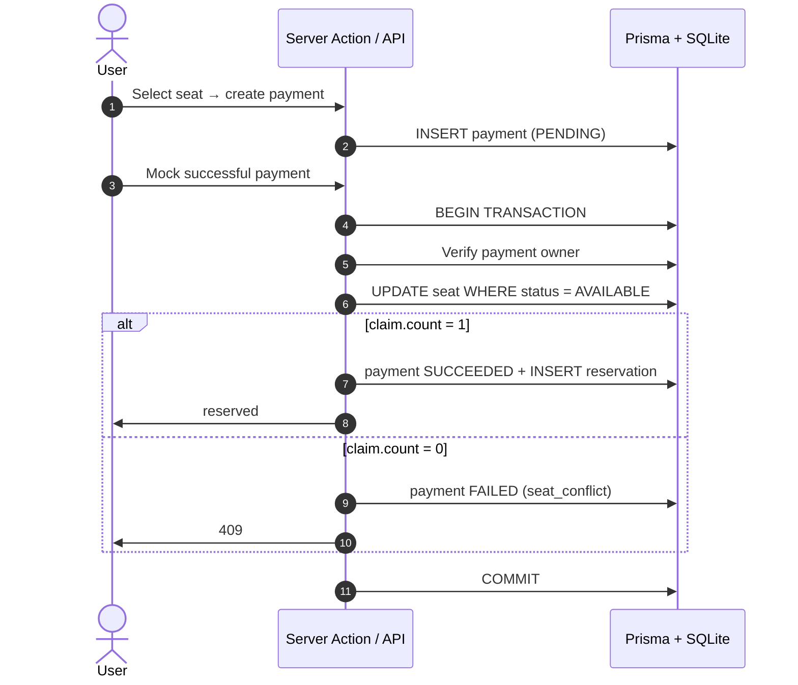

# Linkz Seats

Public seat reservation demo: three seats (`A1`–`A3`), credentials login, mock
checkout, and reservation only after a successful payment.

Built with Next.js App Router, a feature-sliced layout, typed domain `Result`s,
Server Actions for mutations, and Vitest tests for payment/reservation
invariants (including concurrent completion races).

## Stack

| Layer        | Choice |
| ------------ | ------ |
| Framework    | Next.js 14 (App Router), React 18, TypeScript (strict) |
| Data         | Prisma 5, SQLite locally (`file:./dev.db`) |
| Auth         | NextAuth credentials, JWT session (90 days) |
| UI           | Tailwind CSS, lucide-react, sonner toasts |
| Validation   | Zod (HTTP payloads + `src/lib/env.ts`) |
| Tests        | Vitest, real Prisma client against `prisma/test.db` |

## Features

- Public home page with a visual seat map (stage, status badges, keyboard focus).
- Light theme by default; optional dark mode (persisted in `localStorage`).
- Sign-in with demo credentials; seat selection redirects guests to `/login`.
- Payment intent via Server Actions; mock checkout (success / failure).
- Seat becomes `RESERVED` only inside `completePaymentAndReserve` transaction.
- Failed payments leave the seat `AVAILABLE`.
- Idempotent successful re-completion; ownership checks; `409` on seat races.

## Quick start

### Prerequisites

- Node.js **20.11+**
- npm

### 1. Install

```bash
npm install
```

### 2. Environment

Copy `.env.example` to `.env` and set at least:

```env
DATABASE_URL="file:./dev.db"
NEXTAUTH_URL="http://localhost:3000"
NEXTAUTH_SECRET="use-a-long-random-string-here"
```

`src/lib/env.ts` validates variables at startup. In production,
`NEXTAUTH_SECRET` and `NEXTAUTH_URL` are required.

Optional: `LOG_LEVEL` — `debug` | `info` | `warn` | `error` (default: `debug`
in development, `info` in production).

### 3. Database

```bash
npm run db:migrate
npm run db:seed
```

`db:seed` runs `prisma/seed.mjs` (committed to the repo). It upserts:

| Field    | Value |
| -------- | ----- |
| Email    | `demo@example.com` |
| Password | `password123` |
| Seats    | `A1`, `A2`, `A3` (all `AVAILABLE`) |

Local DB files (`prisma/dev.db`, `prisma/test.db`) are gitignored.

### 4. Run

```bash
npm run dev
```

Open [http://localhost:3000](http://localhost:3000).

## Scripts

| Script | Description |
| ------ | ----------- |
| `npm run dev` | Development server |
| `npm run build` | `prisma generate` + production build |
| `npm run start` | Production server (after `build`) |
| `npm run lint` | ESLint, zero warnings allowed |
| `npm run format` | Prettier write |
| `npm run format:check` | Prettier check only |
| `npm test` | Reset `test.db`, `db push`, Vitest (7 tests) |
| `npm run test:watch` | Vitest watch (`test.db` must exist — run `npm test` once first) |
| `npm run db:generate` | Regenerate Prisma Client |
| `npm run db:migrate` | Apply migrations (`prisma migrate dev`) |
| `npm run db:seed` | Seed demo user and seats |
| `npm run db:studio` | Prisma Studio |

`test` and related scripts use `cross-env` so they work on Windows and Unix.

## Project layout

```text
prisma/
  schema.prisma
  seed.mjs              npm / Prisma seed entry (no TS build step)
  migrations/
src/
  app/                  Routes, API handlers, global styles
    api/                JSON API (same domain as Server Actions)
    payment/[paymentId] Checkout + loading / not-found
  components/
    ui/                 Button, Card, Badge, Input, ThemeToggle
    site-header.tsx
    theme-script.tsx    Inline script: light default, no FOUC
  features/
    auth/               NextAuth options, session, login UI
    payments/           Domain, schemas, actions, checkout UI, tests
    seats/              Queries, seat-map UI
  lib/                  Shared utilities (db, env, result, seed.ts, …)
```

`src/lib/seed.ts` holds the seed logic used in tests; `prisma/seed.mjs` mirrors
it for `npm run db:seed` without compiling TypeScript.

## Reservation flow

Core functions (parameterised by `PrismaClient`, return `Result<T, Code>`):

- `features/payments/create-payment-intent.ts` — `PENDING` payment, seat unchanged
- `features/payments/complete-payment.ts` — transactional reserve or failure



Race safety: two completions for the same seat — only one `updateMany` succeeds;
the other gets `seat_conflict` and its payment is marked failed (covered in tests).

## Mutations: Server Actions and API

| Surface | Path | Used by |
| ------- | ---- | ------- |
| Server Actions | `features/payments/actions.ts` | React UI (`useTransition`, toasts, `revalidatePath`) |
| REST | `POST /api/payments` | External / curl clients |
| REST | `POST /api/payments/:id/complete` | External / curl clients |

Both call the same domain functions. HTTP status mapping lives in
`src/app/api/http.ts`:

| Domain code | HTTP |
| ----------- | ---: |
| `unauthorized` | 401 |
| `forbidden` | 403 |
| `seat_not_found`, `payment_not_found` | 404 |
| `invalid_input` | 422 |
| `seat_unavailable`, `seat_conflict` | 409 |

Unmapped codes default to **400** so missing mappings show up in review.

## Trade-offs (intentional)

- **SQLite** — zero-config for reviewers; production would use Postgres.
- **No seat hold** — no TTL/cleanup while user is on checkout; another user can
  win the seat → handled as `seat_conflict`.
- **Mock payments** — synchronous buttons; real flow needs webhooks + provider
  idempotency.
- **Credentials auth** — demo only; production needs rate limits, reset flow, etc.
- **Tests** — domain/integration only, not full E2E UI.

## Manual verification

1. Open `/` logged out — three seats visible.
2. Select a seat — redirect to login.
3. Sign in: `demo@example.com` / `password123`.
4. Select seat → proceed to payment.
5. **Mock failed payment** — seat stays available, toast shown.
6. Start payment again → **Mock successful payment** — seat reserved.
7. Home shows **Reserved by you** for that seat; refresh persists state.
8. Reserved seat tile is disabled.
9. Optional: toggle dark mode in header (light is default on first visit).
10. `npm test` · `npm run lint` · `npm run build`

## Production checklist (out of scope here)

- Postgres + connection pooling
- Strong `NEXTAUTH_SECRET`, HTTPS, rate limiting
- Real payment provider + signed webhooks
- Observability (structured logs already in `src/lib/logger.ts`)
